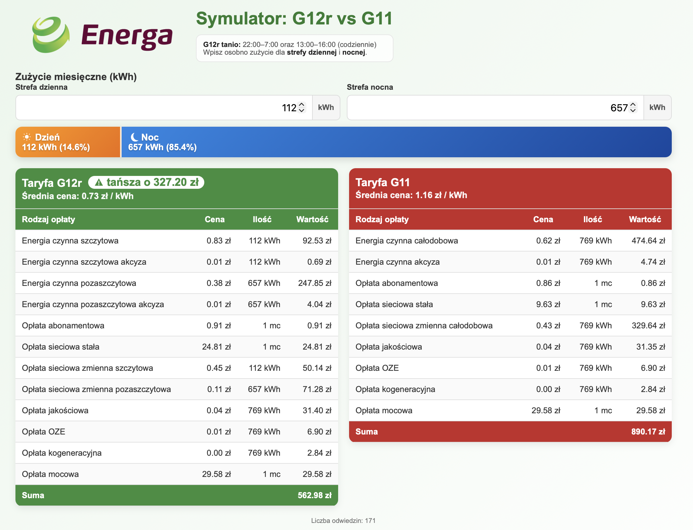

# Symulator taryf energii: G12r vs G11

Prosta aplikacja webowa do porównania szacunkowego miesięcznych kosztów energii dla taryf **G12r** i **G11**.



## Co robi projekt

- porównuje koszt miesięczny dla G12r i G11,
- pozwala wpisać miesięczne zużycie energii osobno dla strefy dziennej i nocnej (kWh),
- pokazuje procentowy udział stref dzień/noc na pasku gradientowym,
- pokazuje rozbicie opłat w tabelach dla obu taryf,
- pokazuje, która taryfa jest tańsza i o ile,
- zlicza odwiedziny strony (`licznik.php` + `licznik.txt`).

## Struktura plików

- `index.html` - interfejs aplikacji, logika obliczeń i prezentacja wyników,
- `licznik.php` - prosty licznik odwiedzin z blokadą pliku,
- `licznik.txt` - aktualna liczba odwiedzin,
- `README.md` - opis projektu.

## Uruchomienie lokalne

### Opcja 1 (pełna, z licznikiem odwiedzin) - serwer PHP

1. Otwórz terminal w katalogu projektu.
2. Uruchom:

```bash
php -S localhost:8000
```

3. Wejdź w przeglądarce na:

```text
http://localhost:8000
```

### Opcja 2 (sam `index.html`)

Możesz otworzyć `index.html` bezpośrednio w przeglądarce, ale licznik odwiedzin nie będzie działał poprawnie bez PHP.

## Uwagi

Wyniki mają charakter orientacyjny i zależą od przyjętych stawek w kodzie (`index.html`).
